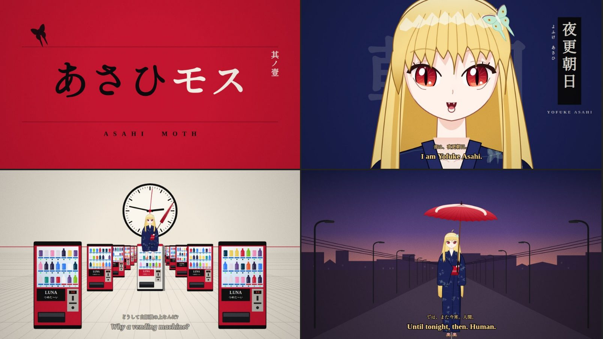

# あさひモス · Asahi Moth

A short surreal anime animation (about four minutes) about **夜更 朝日 (Yofuke Asahi)**, a six hundred year old blonde vampire who spends her nights sitting on top of vending machines in modern Japan, circling the city's "false moons" like a moth.

It's an original story made in homage to the visual language of the *Monogatari* series: title cards flashing in red, black and white, flat colour backgrounds, the head tilt, a geometry lesson in the middle of a conversation, an infinite white void full of vending machines, a clock stuck at 2:47, and a vampire who casts no shadow.



## Watch it

1. Go to **[Releases](../../releases/latest)** and download `asahi-moth.html`.
2. Double click it. It opens in your browser. Press **Play**.

That's it. One file, no install, no server. Everything is drawn live with Canvas 2D and every sound (crickets, the railway crossing bell, the passing train, the konbini chime, piano, sparrows at dawn) is synthesised on the fly with WebAudio. The only thing it fetches online is the typeface (Shippori Mincho B1 and Cormorant Garamond from Google Fonts); offline it falls back to your system's Mincho font.

Best on a desktop browser (Chrome, Edge, Firefox or Safari) with headphones.

| Key | Action |
| --- | --- |
| Space / K | Play / pause |
| ← → | Seek 5 seconds |
| F | Fullscreen |
| M | Mute |
| S | Subtitles on/off |
| J | Japanese subtitle line on/off |

Subtitles are shown in English with the original Japanese line above.

## Build from source

The film lives in `src/` as plain scripts that get stitched into one HTML file:

```
node build.mjs        # -> dist/asahi-moth.html
```

| File | What's in it |
| --- | --- |
| `src/template.html` | Page shell, start screen, control bar |
| `src/00-core.js` | Math, easing, deterministic noise, a tiny SVG path parser |
| `src/01-draw.js` | Text, title cards, glows, grain, vignette |
| `src/02-props.js` | Vending machines, konbini, crossing signals, poles, train, lanterns |
| `src/03-girl.js` | Asahi herself: face, eyes, hair sway, expressions, yukata, parasol |
| `src/04-audio.js` | The WebAudio synth and sound design |
| `src/05-sets.js` | Locations (the crossing, the konbini, the void, the dawn street) |
| `src/06-story.js` | The shot list: timing, dialogue, cues, ambience |
| `src/07-player.js` | Timeline, subtitles, controls |

Every frame is a pure function of time, so you can jump to any moment with `?t=SECONDS` (add `&still` for a single frame with no UI).

## Releasing

Pushing a tag like `v1.0.1`, or running the **Release** workflow manually from the Actions tab, builds the file and attaches it to a GitHub release.

---

*Asahi Moth is an original work. It is not affiliated with the Monogatari series, NISIOISIN, Kodansha, Aniplex or SHAFT.*
